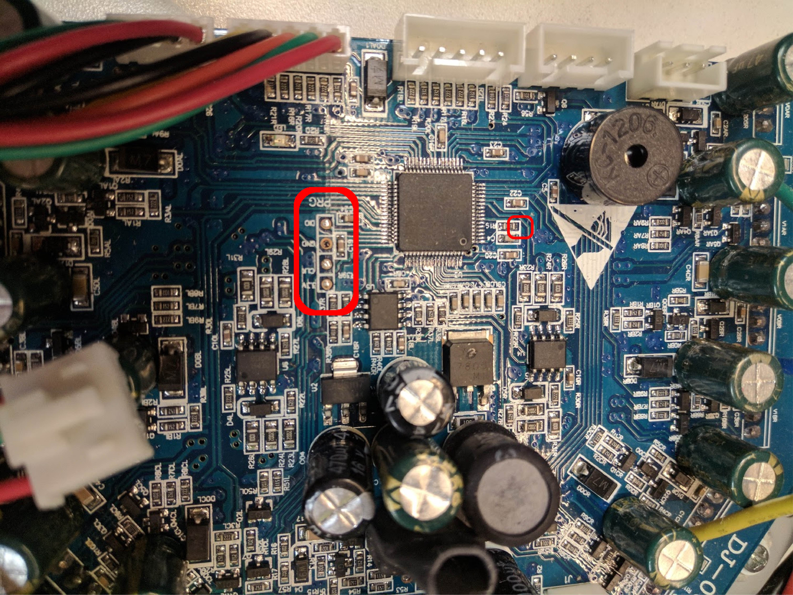

# Getting Started - Hardware Setup
## Materials needed
* hoverboard motor controller board
* screwdriver
* solder / soldering iron / solder pump
* 4 male header pins
* 4-5 female to female jumper wires (5th one optional for reset pin)
* optional female to male jumper wire (and wire cutters) (for reset pin)
* ST Link V2


## Setting up the board
In the setup, we'll be referencing positions of certain things on the board. To make sure we're all on the same page, let's orient the board such that the longest side is at the top.

Before we can wire anything up, we'll need to prepare the board by soldering debug pins onto it, marked in red below:



1. Unscrew all 12 screws on the perimeter of the board to remove the metal plate backing.
2. Remove the solder from the debug pin holes (using the iron and the solder pump).
3. Place the 4 male header pins into the debug pin holes.
4. Solder the pins into place
5. Screw the 12 screws back to put the metal plate back.

Time for the reset pin! Note that this is entirely optional. By doing the next few steps, it makes programming the device a lot more reliable. Otherwise, it may take a few tries to program the device successfully.

6. (Optional) Cut a female to female jumper wire so that wire is as long as possible.
7. (Optional) Taking the long piece, strip a tiny bit off the snipped part, and solder it into the far end of the resisitor attached to pin 7 (just to the right of the ST, marked in red above). It may be marked R15 or R19 depending on your hoverboard model.

## Wiring
To flash the ST, we'll need to connect the debug pins to our ST Link V2 microcontroller. The 4 pins to the left of the ST, from top to bottom, are:
```
SWDIO
GND
SWCLK
3.3V
```

Depending on what ST Link V2 you have, you'll hook it up differently.
If you have the [10 pin version](https://www.mouser.com/ProductDetail/Adafruit/2548/?qs=SElPoaY2y5K%252bwHNUAvyTvg%3D%3D) that plugs directly into the computer USB port, just match each of the debug pins to however your ST Link V2 is labeled:

|  Motor Board |  ST Link V2  |
|:---:|:---:|
| SWDIO  | SWDIO  |
|  GND |  GND |
| SWCLK  |  SWCLK |
| 3.3V  | 3.3V  |
| reset pin (optional)  |  RST |


If you have the [20 pin version](https://www.mouser.com/ProductDetail/STMicroelectronics/ST-LINK-V2/?qs=H4BOwPtf9MC1sDQ8j3cy4w%3D%3D), reference the following pinout:


|  Motor Board |  ST Link V2  |
|:---:|:---:|
| SWDIO  | SWDIO  (Pin 7)|
|  GND |  GND  (Pin 12, 18, or 20)|
| SWCLK  |  SWCLK (Pin 9)|
| 3.3V  | 3.3V  (Pin 2) <br> (And connect Pin 1 to Pin 19*)|
| reset pin (optional)  |  RST (Pin 15)|

*We need to 1) power the ST and 2) let the ST Link know that the device is powered (TVCC). To do this, we use Pin 19's 3.3V to power both TVCC (Pin 1 & Pin 2) and the 3.3V pin on the motor board. Since Pins 1 and 2 are internally connected, connecting Pin 19 to either of them powers the other one, and we can connect the other one to the 3.3V pin on the motor board.